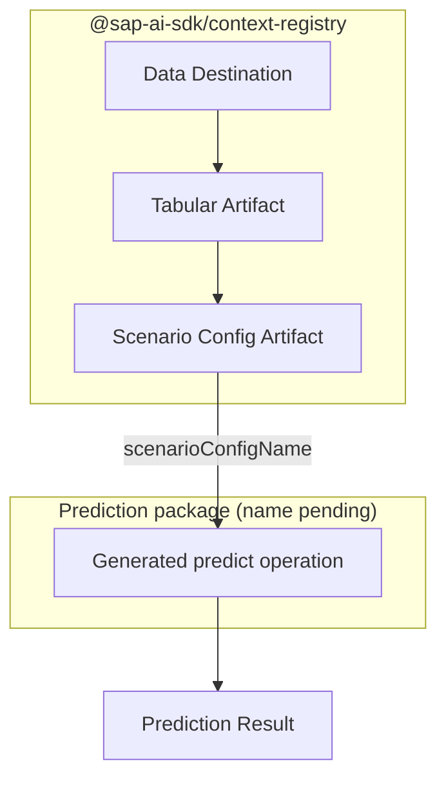

# Tabular orchestration SDK Release Strategy

## Status

decided

## Context

Providing SDK clients for the Tabular AI Orchestration and Context Registry services is a significant undertaking.
These are two independent components maintained by separate teams:

- The **Tabular AI Orchestration** prediction client handles virtual deployment in AI Core, routes requests to the prediction model, and performs context selection.
- The **Context Registry** client handles data destinations, tabular artifacts, tabular scenarios, and HANA DB.

Neither requires the other to be implemented or released first.
An end-to-end workflow commonly uses both to prepare context and submit a prediction.

The diagram shows the typical end-to-end path: a data destination is registered, tabular artifacts are uploaded and associated with it, a scenario configuration artifact ties them together, and the resulting `scenarioConfigName` is passed directly to the prediction client.
The two core packages are independent — users who already have a scenario configuration name skip the context registry client entirely — but the end-to-end workflow requires both.

Release order and implementation order are separate decisions.
The prediction and context-registry clients can be tracked, implemented, reviewed, and released as independent efforts.

## Decision

Develop and release the Context Registry and Tabular AI Orchestration clients independently when each is usable.
The first releases are explicitly experimental: they prioritize availability and feedback over a complete convenience API or a coordinated end-to-end release.

Each experimental package starts from its generated client.
Handwritten convenience is deferred to follow-up work, except for the deployment resolution and required header handling needed to execute prediction requests through SAP AI Core.

The Context Registry package is named `@sap-ai-sdk/context-registry`.
The prediction package name is tracked separately in [ADR 011](./011-tabular-orchestration-prediction.md).

## Discussion

### Question 1: Client Release Order

#### Option A: Prediction Client First

Release prediction first; users initially provide existing scenario configuration names and manage registry resources through other tooling or direct API calls.

**Pros:**

- Delivers the primary prediction capability earlier.
- Has a smaller generation surface: one specification and one main operation.
- Allows feedback on prediction request types, model handling, and package boundaries before the larger registry API is finalized.

**Cons:**

- Does not initially provide a complete SDK-only setup workflow.
- Samples depend on pre-existing registry resources or temporary direct API usage.
- Prediction-client design remains exposed to unresolved changes in scenario and artifact contracts.

#### Option B: Context Registry First

Release the context-registry client before the prediction client.

**Pros:**

- Establishes resource-management primitives before prediction workflows depend on them.
- Gives users value for provisioning and managing data destinations, artifacts, and scenarios independently of prediction.
- Exercises the more complex specification and asynchronous service behavior first.

**Cons:**

- Delays the primary prediction use case.
- At the time this option was considered, the client depended on the Context Registry team's authoritative specification.
- Users of the initial release cannot complete predictions or verify that configured registry resources meet their needs in a prediction scenario.

#### Option C: Release Both Clients Together

Hold both clients until a coordinated release provides the complete workflow.

**Pros:**

- Delivers one coherent end-to-end experience.
- Allows package names, shared concepts, examples, and compatibility expectations to be reviewed together.
- Avoids a temporary state in which documentation relies on unsupported setup paths.

**Cons:**

- The less mature contract blocks the entire release.
- Increases the initial review, test, and documentation scope.
- Delays user feedback that could improve either client independently.

#### Option D: Independent Experimental Releases as Ready (selected)

Create separate delivery tickets, each with its own owner, scope, review, tests, documentation, and release criteria.
Work may proceed concurrently or at different times; whichever experimental client becomes usable first is released first.

This is a release-as-we-go strategy rather than a commitment to parallel completion, a predetermined order, or a coordinated launch.

**Pros:**

- Avoids blocking one client on unresolved work in the other.
- Allows ownership and scheduling to follow available capacity.
- Delivers whichever usable client matures first without predicting that order upfront.
- Keeps each ticket, review, and release milestone focused.

**Cons:**

- The first release may not provide a complete SDK-only workflow.
- Shared package naming, concepts, and documentation still require coordination.
