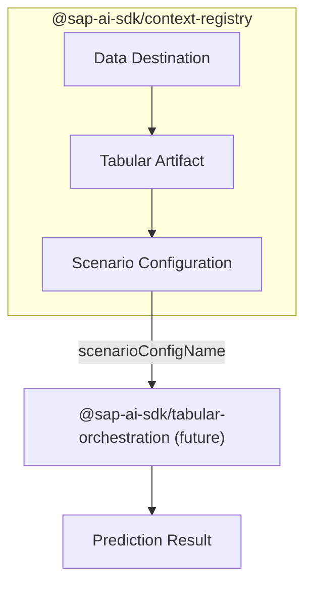

# @sap-ai-sdk/context-registry

> [!warning]
> This package is still in **beta** and is subject to breaking changes. Use it with caution.

SAP Cloud SDK for AI is the official Software Development Kit (SDK) for **SAP AI Core**, **SAP Generative AI Hub**, and **Orchestration Service**.

This package provides a client for SAP’s Context Registry, managing the context for Tabular Orchestration service predictions.

As part of this you can list, create, update, and delete Data Destinations, Scenario Configurations and Tabular Artifacts.



### Table of Contents

- [Installation](#installation)
- [Documentation](#documentation)
- [Support, Feedback, Contribution](#support-feedback-contribution)
- [License](#license)

## Installation

```
$ npm install @sap-ai-sdk/context-registry
```

## Documentation

Visit the [SAP Cloud SDK for AI (JavaScript)](https://sap.github.io/ai-sdk/docs/js/overview-cloud-sdk-for-ai-js) documentation portal to learn more about its capabilities and detailed usage.

## Support, Feedback, Contribution

Contribution and feedback are encouraged and always welcome.
For more information about how to contribute, the project structure, as well as additional contribution information, see our [Contribution Guidelines](https://github.com/SAP/ai-sdk-js/blob/main/CONTRIBUTING.md).

## License

The SAP Cloud SDK for AI is released under the [Apache License Version 2.0](http://www.apache.org/licenses/).
