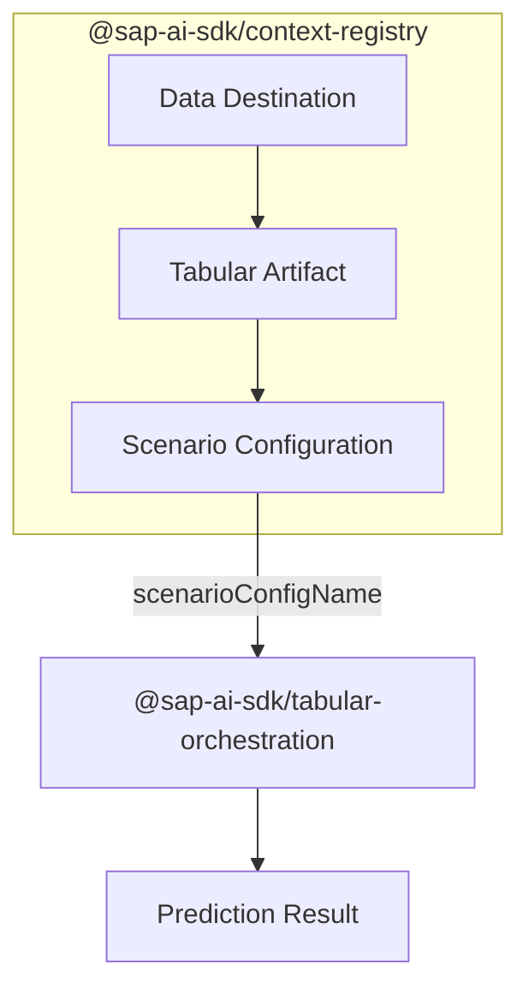

# @sap-ai-sdk/tabular-orchestration

> [!warning]
> This package is still in **beta** and is subject to breaking changes. Use it with caution.

SAP Cloud SDK for AI is the official Software Development Kit (SDK) for **SAP AI Core**, **SAP Generative AI Hub**, and **Orchestration Service**.

This package provides a client for the SAP AI Core Tabular AI Orchestration service, which makes predictions with Tabular Foundation Models such as [SAP-RPT-1](https://www.sap.com/products/artificial-intelligence/sap-rpt.html).

Context for predictions can be provided inline or selected from tabular artifacts referenced by a scenario configuration, which can be managed with [`@sap-ai-sdk/context-registry`](https://www.npmjs.com/package/@sap-ai-sdk/context-registry).



### Table of Contents

- [Installation](#installation)
- [Usage](#usage)
- [Documentation](#documentation)
- [Support, Feedback, Contribution](#support-feedback-contribution)
- [License](#license)

## Installation

```
$ npm install @sap-ai-sdk/tabular-orchestration
```

## Usage

The client resolves a running deployment of the `tabular-orchestration` scenario and sends the request body as defined by the service specification.

```ts
import { TabularOrchestrationClient } from '@sap-ai-sdk/tabular-orchestration';

const client = new TabularOrchestrationClient({ resourceGroup: 'default' });

const { predictions } = await client.predict({
  modelName: 'sap-rpt-1.6',
  scenarioConfigName: 'my-scenario-config',
  contextSelectionConfig: {
    strategy: 'random',
    numRows: 100,
    strategyConfig: {}
  },
  predictionConfig: {
    targetColumns: [{ name: 'salesgroup', task_type: 'classification' }]
  },
  modelConfig: { index_column: 'id' },
  rows: [{ id: '42', product: 'Desktop Computer', salesgroup: '[PREDICT]' }]
});
```

## Documentation

Visit the [SAP Cloud SDK for AI (JavaScript)](https://sap.github.io/ai-sdk/docs/js/overview-cloud-sdk-for-ai-js) documentation portal to learn more about its capabilities and detailed usage.

## Support, Feedback, Contribution

Contribution and feedback are encouraged and always welcome.
For more information about how to contribute, the project structure, as well as additional contribution information, see our [Contribution Guidelines](https://github.com/SAP/ai-sdk-js/blob/main/CONTRIBUTING.md).

## License

The SAP Cloud SDK for AI is released under the [Apache License Version 2.0](http://www.apache.org/licenses/).
